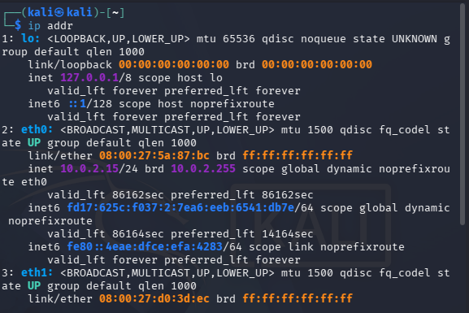
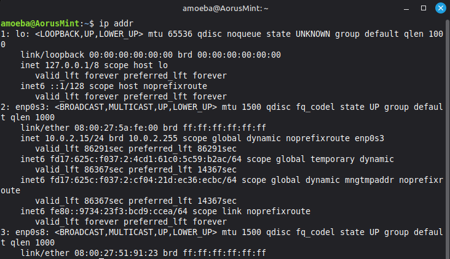
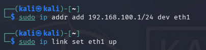
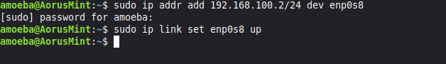

# Network Identification

## IP address breakdown

(`192.168.100.10/24`)

```
 192 . 168 . 100  .  10   /   24
└───────┬───────┘   └─┬─┘    └─┬─┘
  Network Part     Host ID  Subnet Mask
 (Subnet Group)  (Machine)   (Boundary)
```
| Component | Value | Explanation |
| :--- | :--- | :--- |
| **IP Address** | `192.168.100.10` | full address of this machine |
| **Subnet Mask** | `/24` | rule: The first 3 numbers set the group |
| **Subnet** | `192.168.100.0` | the group. all machine starting with `192.168.100` can talk |
| **Host ID** | `.10` | unique number for this single machine |

## Assign IP to Adapter2 (eth1)
Used `ip addr` command to identify IP of Kali Linux and Linux Mint. Image below shows that eth1 & enp0s8 does not have any IP because its and Internal Network that does not come with DHCP, unlike eth0 & enp0s3 (NAT)

 

*Output of sudo ip addr add <IP> dev eth1 command* for Kali Linux



*Output of sudo ip addr add <IP> dev enp0s8 command* for Linux Mint


The **solution** is to manually assign the IP for eth1 and enp0s8 using:

* `sudo ip addr add <IP> dev <interface>` — Assigns the static IP to the interface.

* `sudo ip link set <interface> up` — Activates the interface so it can send and receive data




