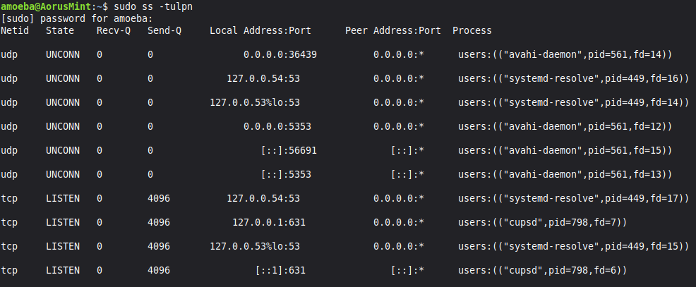

# Understanding Listening Ports with `ss -tulpn`

## Active Listening Services Analysis

### Kali Linux
* **Result:** None.
* **Explanation:** Kali has **no services** currently waiting for incoming network connections. The output of `ss -tulpn` was completely empty, which is normal for an attacker OS configured without active server daemons.

---

#### Linux Mint

Linux Mint has **three primary background services** waiting for incoming network connections:

| Service / Process | Protocol | Local Address:Port | Purpose | Accessible from Kali? |
| :--- | :--- | :--- | :--- | :--- |
| `cupsd` | TCP | `127.0.0.1:631` `[::1]:631` | Common Unix Printing System (printer service) | **No** (Bound strictly to `localhost`/internal loopback) |
| `systemd-resolve` | TCP & UDP | `127.0.0.53:53` `127.0.0.54:53` | Local system DNS resolver cache | **No** (Bound strictly to local loopback IPs) |
| `avahi-daemon` | UDP | `0.0.0.0:5353` `0.0.0.0:36439` `[::]:5353` `[::]:56691` | mDNS / DNS-SD (local device and hostname discovery) | **Yes** (`0.0.0.0` listens on **all** interfaces, including the isolated subnet `192.168.100.2`) |

---

#### Key Security Takeaway
* **No TCP services are exposed to the isolated network:** Services listening on `127.0.0.x` only accept connections originating from Linux Mint itself.
* **Only UDP `avahi-daemon` is exposed:** Because it is bound to `0.0.0.0`, it can receive UDP discovery packets from Kali on the isolated network.
