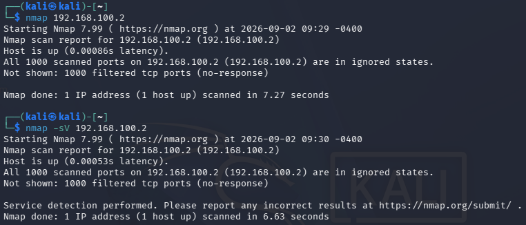

# Scan Linux Mint from Kali with `nmap`

The screenshot shows the output from running both `nmap` and `nmap -sV` against Linux Mint (`192.168.100.2`).

* The `-sV` flag stands for **Service Version detection**.

---

## Why Both Scans Showed the Same Result

* Both outputs reported `1000 closed tcp ports (reset)`.
* Because Nmap found **zero open ports**, `-sV` had no active services to probe for versions. Both scans therefore produced identical results.

---

## Nmap Scan & Listening Services Analysis

### 1. Scan Results Summary
* **Open Ports:** None found (0 open ports).
* **Closed Ports:** All 1,000 scanned TCP ports returned as `closed (reset)`.
* **Services Detected:** None.
* **MAC Address Resolution:** `08:00:27:51:91:23 (Oracle VirtualBox virtual NIC)` — confirms successful Layer 2 ARP communication across the isolated subnet.

---

### 2. Understanding Port State: Filtered vs. Closed

| State | What Nmap Received | Meaning |
| :--- | :--- | :--- |
| **Filtered (`no-response`)** | Nothing (timed out) | Packets were dropped silently by a firewall or network route failure. |
| **Closed (`reset`)** | TCP RST packet | Packets reached Linux Mint; the OS actively replied that no application is listening on that port. |

---

### 3. Comparison: Nmap (Kali) vs. `ss -tulpn` (Linux Mint)

**Question:** Does what Kali sees match what Linux Mint says is listening?

**Answer:** Yes, the results match completely.

* **TCP vs. UDP:** Standard `nmap` checks only TCP ports. Linux Mint's only network-wide service (`avahi-daemon`) operates over **UDP port 5353**, making it invisible to standard TCP scans.
* **Localhost Restrictions:** The TCP services running on Linux Mint (`cupsd` on port 631 and `systemd-resolve` on port 53) are bound strictly to loopback addresses (`127.0.0.1` and `127.0.0.53`). They only accept internal traffic originating from Mint itself.
* **Active Rejection:** Because no service is bound to the isolated network interface (`192.168.100.2`), Linux Mint's kernel actively rejects incoming TCP connection attempts with a TCP Reset (`RST`), marking the ports as `closed`.

---

### 4. Service Visibility Summary

| Service | Protocol & Port | Bound Address | Reachable by Kali? | Reason |
| :--- | :--- | :--- | :--- | :--- |
| `cupsd` | TCP 631 | `127.0.0.1` | No | Bound only to internal loopback. |
| `systemd-resolve` | TCP/UDP 53 | `127.0.0.53` | No | Bound only to internal loopback. |
| `avahi-daemon` | UDP 5353 | `0.0.0.0` | Yes (UDP only) | Missed by default TCP scan; requires `-sU` to detect. |
