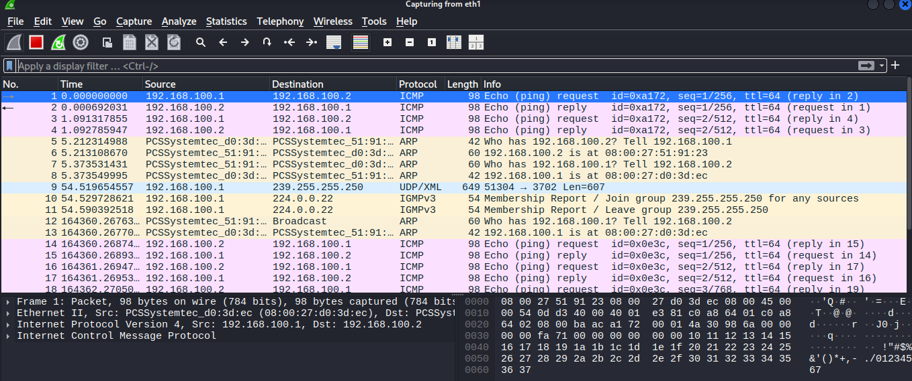
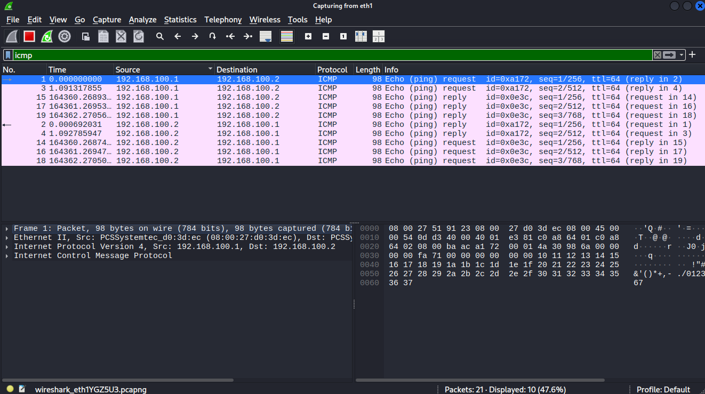
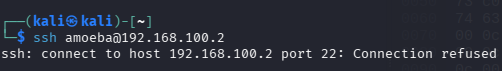
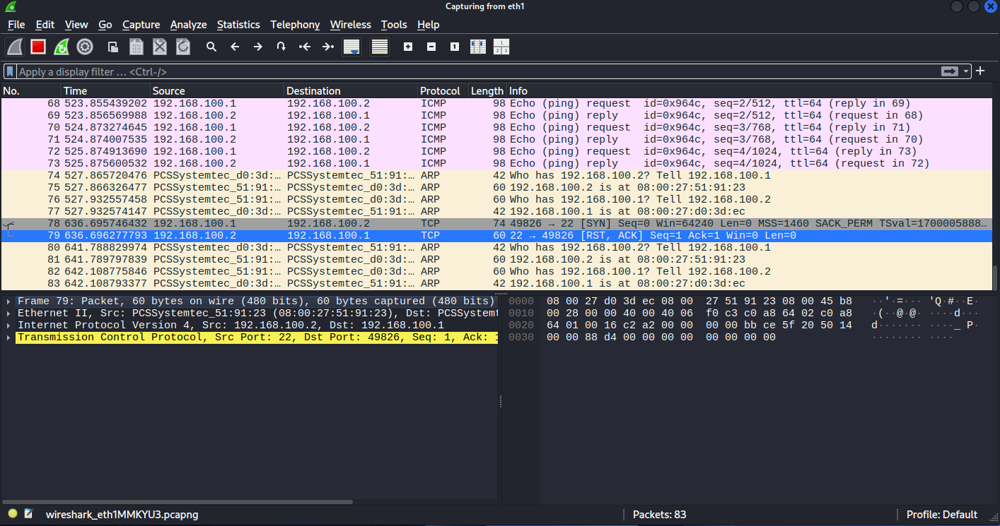

# Wireshark Packet Capture
This section covers capturing and analyzing live network traffic on the isolated network interface (Adapter 2 / eth1 / enp0s8)

---

## 1.0 Network Interface Recovery

Before starting the capture, connectivity between Kali Linux and Linux Mint was tested with `ping`

```
PING 192.168.100.2 (192.168.100.2) 56(84) bytes of data.
^C
--- 192.168.100.2 ping statistics ---
31 packets transmitted, 0 received, 100% packet loss, time 30847ms
```

### Issue
Rebooting Kali Linux wiped the non-persistent static IP (192.168.100.1) assigned earlier via the terminal

### Fix
Re-assigned the static IP to eth1 and brought the interface up with the same commands used before when assigning the IP the first time

`sudo ip addr add <IP> dev <interface>`

`sudo ip link set eth1 up`

---


## 2.0 Start Capturing with Wireshark

* **Interface Selected**: eth1 (the isolated 192.168.100.0/24 network)

* **Initial Observation**: Wireshark showed zero packets right after launch

* **Reason**: This is an isolated, closed internal network with only two machines. With no router, internet gateway, or DHCP server constantly broadcasting, there is zero background traffic until an action is triggered

---


## 3.0 Capturing ICMP Traffic (ping)

Generated network traffic by pinging bidirectionally between Kali and Linux Mint





### Observed Packets

* ARP (Address Resolution Protocol): Broadcasts asking who owns a specific IP so the hosts can resolve Layer 2 MAC addresses

* ICMP Echo Request: Sent by the source machine asking if the target is reachable

* ICMP Echo Reply: Sent by the target confirming it received the request

---


## 4.0 Capturing SSH Traffic (ssh)

Attempted an SSH connection from Kali to Linux Mint with `ssh amoeba@192.168.100.2`

### Terminal Result: 



### Wireshark Result:



*Refer to packet No. 78 and 79*

* Packet 78 (Kali $\rightarrow$ Mint): Kali sends a [SYN] packet to start the TCP 3-way handshake on port 22
* Packet 79 (Mint $\rightarrow$ Kali): Mint replies with [RST, ACK]. The host exists, but because no SSH server (sshd) is listening on port 22, the OS actively drops the connection attempt with a TCP Reset

---


## 5.0 Notes

### What is the TCP three-way handshake?

```The 3-step process TCP uses to establish a reliable connection before transmitting data:
SYN (Synchronize): Client asks to open a connection with an initial sequence number.

SYN-ACK (Synchronize-Acknowledge): Server agrees and sends back its own sequence number.

ACK (Acknowledge): Client confirms receipt; socket state becomes ESTABLISHED
```

### Why cant you simply read SSH commands in Wireshark?

* While headers (IP addresses, MAC addresses, port 22) are visible, the application payload itself is fully encrypted
