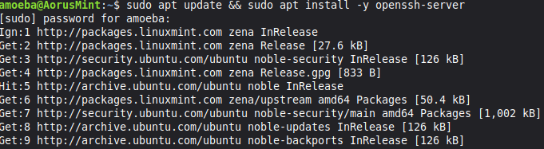
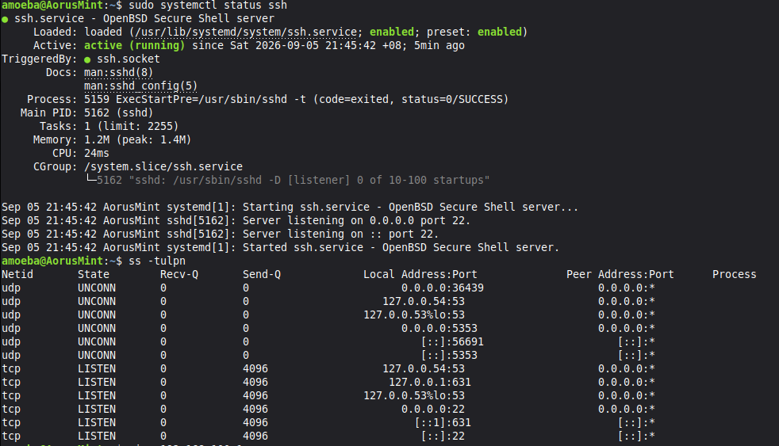
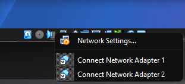
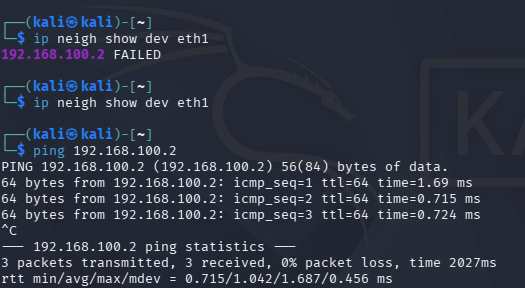
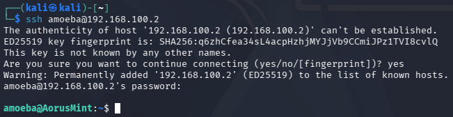
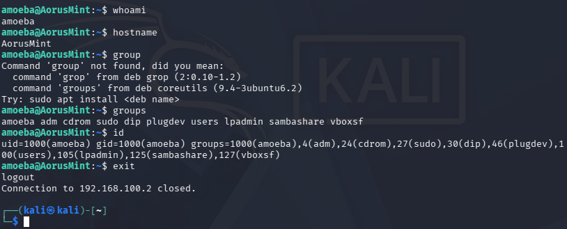
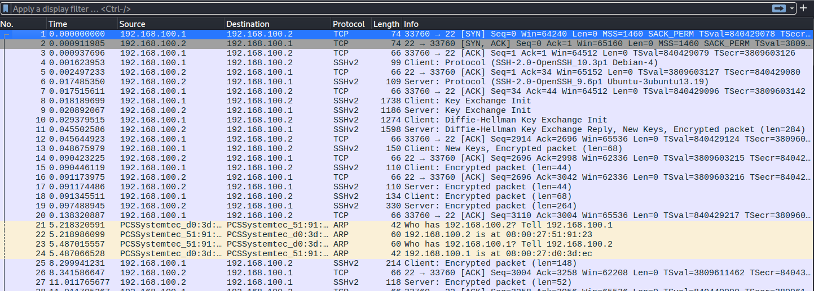

# SSH  Kali $\rightarrow$ Linux Mint

This section records the installation and configuration of the OpenSSH service on Linux Mint, troubleshooting Layer 2/3 reachability failures across the VirtualBox internal network, and validating the final encrypted SSH session with Wireshark packet analysis

---

## 1.0 Install SSH Service in Linux Mint
The previous SSH connection attempt failed with `Connection refused` because no SSH daemon was running on the target machine (linux mint)

### Installation & Service Activation (Linux Mint)

On Linux Mint, OpenSSH server was installed and enabled with:

`sudo apt update && sudo apt install -y openssh-server` 

`sudo systemctl enable --now ssh`




Verification showed the daemon listening on TCP port 22:



---

## 2.0 Post-Installation Connection Failure & Diagnostics

After starting the SSH service, a new connection was attempted from Kali with `ssh amoeba@192.168.100.2`

### Output (error)
```
ssh: connect to host 192.168.100.2 port 22: No route to host
```

### ICMP Connectivity Test

Bidirectional ping tests were performed to verify basic reachability:

* Kali $\rightarrow$ Linux Mint
```
PING 192.168.100.2 (192.168.100.2) 56(84) bytes of data.
--- 192.168.100.2 ping statistics ---
6 packets transmitted, 0 received, 100% packet loss
```

* Linux Mint $\rightarrow$ Kali
```
From 192.168.100.2 icmp_seq=1 Destination Host Unreachable
```

---

## 3.0 Troubleshooting

### 3.1 Interface State Verification

Both machines were inspected with `ip addr show <interface>` to confirm the non-persistent static IP configuration was intact

* Linux Mint (enp0s8):
```
Interface state <BROADCAST,MULTICAST,UP,LOWER_UP>, assigned 192.168.100.2/24
```
* Kali Linux (eth1):
```
Interface state <BROADCAST,MULTICAST,UP,LOWER_UP>, assigned 192.168.100.1/24
```

Both interfaces were administratively **UP** with correct IP assignments, ruling out IP misconfiguration

---

### 3.2 VirtualBox Adapter Adjustment

On Linux Mint's virtual machine settings (Settings $\rightarrow$ Network $\rightarrow$ Adapter 2)

* Changed Promiscuous Mode from Deny to Allow VMs to permit inter-VM frame reception

#### 3.2.1 Inspecting Neighbor Cache `ip neigh show`

The command `ip neigh show dev <interface>` displays the kernel's ARP (Address Resolution Protocol) cache table. It shows the mapping between local IPv4 addresses and hardware MAC addresses discovered on that link.

* Success on Linux Mint but **FAILED** in Kali Linux

---

### 3.3 Virtual Cable Toggle & Resolution

To reset the virtual switch link state:

1. In VirtualBox, opened network settings for both VMs and unchecked Cable Connected on Adapter 2
2. Waited 3 seconds, then re-checked Cable Connected on both VMs



#### 3.3.1 Retested neighbor resolution on Kali



Layer 2 communication was fully restored

---

## 4.0 Successful SSH Session & Remote Execution

With the link operational, the SSH connection was executed from Kali with `ssh <username>@<IP>



### Remote Host Verification Commands

Inside the active remote shell, `whoami` `hostname` `groups` `id` commands were run to confirm direct control over Linux Mint




### Network Traffic from Wireshark



