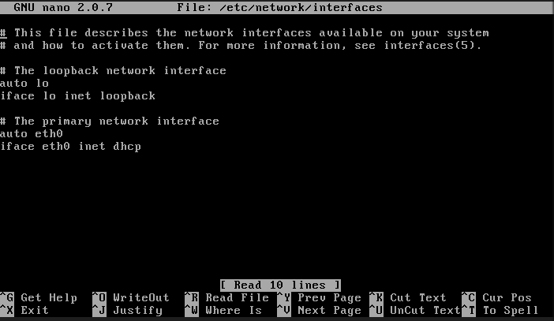
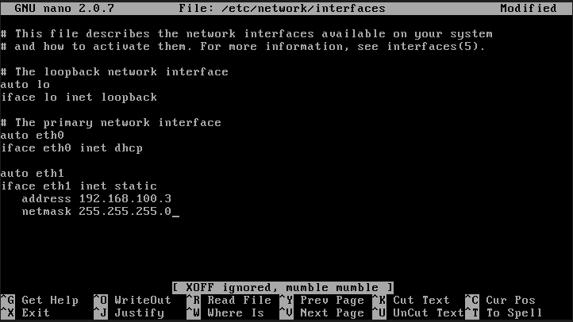
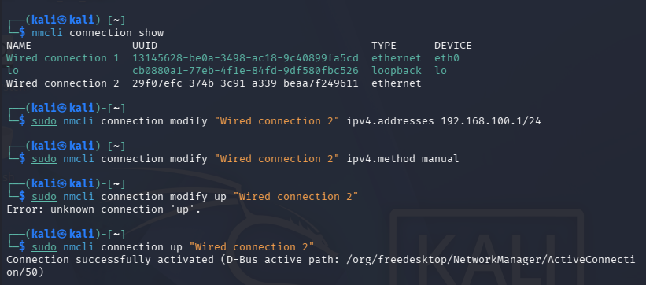
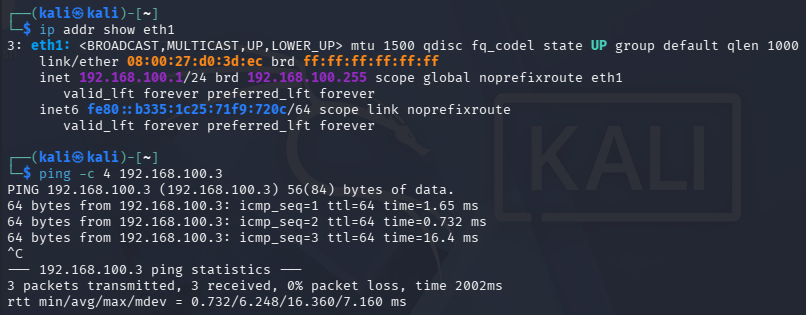
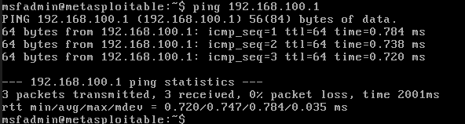

# Network Interface and Static IP Configuration

In previous lab setups, runtime IP assignments to virtual network adapters (Adapter 2) were non-persistent, requiring manual reassignment after every system reboot. To ensure uninterrupted connectivity across lab sessions, static IP configurations were implemented to persist across reboots on both the target (Metasploitable 2) and the attacker machine (Kali Linux).

---

## 1.0 Metasploitable 2 IP Configuration (Target Machine)

### Step 1: Interface Inspection
To check the state of the secondary network adapter (Adapter 2), network details were inspected using both `ifconfig` and `ip addr`:

- `ifconfig` only displayed active interfaces (`lo` and `eth0`), omitting `eth1`.
- `ip addr` displayed `eth1` in an unconfigured, inactive state without an assigned IPv4 address.

### Step 2: Editing Network Configuration File
The interface definition file was opened using the Nano text editor with administrative privileges:

`sudo nano /etc/network/interfaces`

The following static network configuration block for eth1 was appended to the end of the file:

```
auto eth1
iface eth1 inet static
    address 192.168.100.3
    netmask 255.255.255.0
```
 

### Step 3: Activating the Interface

Used the command `sudo ifup eth1` to bring up the interface

Verification with ifconfig eth1 confirmed that the link state changed to UP with the static IP 192.168.100.3 properly assigned

---

## 2.0 Kali Linux IP Configuration (Attacker Machine)

Kali Linux relies on NetworkManager for persistent connection profiles. The secondary interface (eth1) was configured with a static IP via nmcli

### Step 1: Identify the Connection Profile

Used `nmcli connection show` to see connection names to identify the profile mapped to eth1: The profile was identified as "Wired connection 2"

### Step 2: Applying Static IP Parameters

The connection profile was modified to use a static IPv4 assignment and reactivated:

- Assign the static IP address and subnet mask (/24)
  
`sudo nmcli connection modify "Wired connection 2" ipv4.addresses 192.168.100.1/24`

- Set the configuration method to manual (static)

`sudo nmcli connection modify "Wired connection 2" ipv4.method manual`

- Reactivate the connection profile to apply changes

`sudo nmcli connection up "Wired connection 2"`



## 3.0 Verification & Connectivity Testing

To verify Layer 3 (IP) connectivity across the isolated internal network (lab-internal-net), an ICMP echo request (ping) was executed from Kali Linux to the Metasploitable 2 target:



